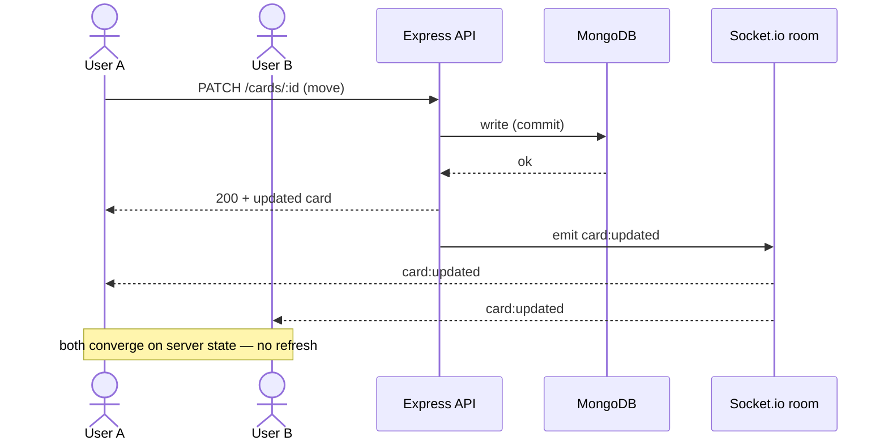
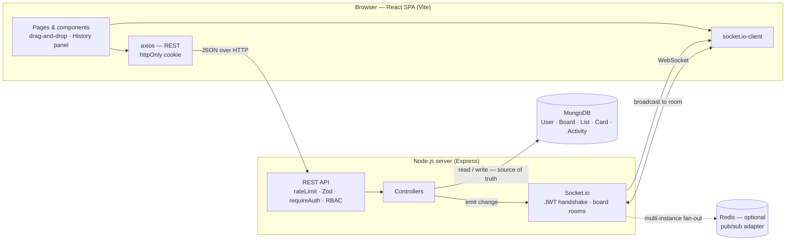

# CollabBoard

A collaborative, real-time project board — a mini Linear/Trello. Multiple people
work on the same board at once: create lists, add cards, drag cards between lists,
and **every change appears instantly for everyone** viewing the board (no refresh),
powered by Socket.io rather than polling. Every action is recorded in a live
**activity history**, and simultaneous edits to the same card are reconciled with
**optimistic concurrency control**.

**Stack:** MongoDB · Express · React (Vite) · Node.js · Socket.io · JWT auth · Tailwind CSS

---

## Highlights

- **Auth & permissions** — JWT (bcrypt-hashed passwords); board **owner** vs **member** roles.
- **Boards / lists / cards** — full CRUD with drag-and-drop, backed by fractional-position ordering (O(1) reorders).
- **Real-time sync** — one person moves a card, everyone sees it instantly. "Commit then broadcast": the DB stays the single source of truth.
- **Activity history** — a durable, live feed of who did what and when, per board.
- **Conflict resolution** — optimistic edits with a version check; concurrent edits surface a merge prompt instead of silently clobbering.
- **Editorial UI** — a warm "paper" theme (Fraunces serif + Inter), colored columns, index-card styling.

**Tests:** 55 passing across auth, boards/RBAC, lists/cards, conflicts, activity,
cookie sessions, validation, and pagination (`npm test`).

### Production hardening

| Concern | Approach |
|---------|----------|
| **Auth storage** | JWT in an **httpOnly, SameSite=Lax cookie** — not readable by page JS (XSS-safe). Bearer header still accepted for API/test clients. |
| **Brute force** | `express-rate-limit` on `/auth/login` and `/auth/register` (per-IP window; disabled under test). |
| **Input validation** | **Zod** schemas validate/normalize every mutating request body before it reaches a controller; failures return `400`. |
| **Pagination** | Boards use `limit`/`offset`; the activity feed uses **cursor pagination** (`_id`-based) with `nextCursor`. |
| **Atomic deletes** | Board deletion cascades lists/cards/activity inside a **MongoDB transaction**, with a sequential fallback on single-node deployments. |
| **Horizontal scaling** | Socket.io uses a **Redis pub/sub adapter** when `REDIS_URL` is set, so `board:<id>` rooms broadcast across instances. |
| **Reconnect resync** | On socket reconnect, the client re-joins the room **and re-fetches board + history**, so events missed while offline are recovered (not silently dropped). |
| **CORS** | Locked to `CLIENT_ORIGIN` with `credentials: true` (required for the cookie). |

**Out of scope** (would matter for a real deployment, intentionally omitted here):
password reset / account recovery, email verification, and refresh-token rotation.

---

## Quick start

Requires **Node ≥ 20**. No database install needed for local dev.

```bash
git clone <repo> && cd collab-board
npm install
npm run dev:server     # API  → http://localhost:4000
npm run dev:client     # web  → http://localhost:5173   (separate terminal)
```

Open **http://localhost:5173** and sign up, or use the seeded demo account:

```
email:    demo@collabboard.app
password: demo1234
```

### Database

- **Zero-setup dev mode (default):** with no `MONGO_URI`, the server runs a local
  MongoDB backed by `mongodb-memory-server`, pointed at an **on-disk path**
  (`.data/db`) with a fixed database name — so **your accounts and boards persist
  across restarts**. Delete `.data/` to reset.
- **Bring your own:** copy `.env.example` → `.env` and set `MONGO_URI`
  (MongoDB Atlas free tier or a local `mongod`) plus `JWT_SECRET`. Required in
  production.

Health check: `curl http://localhost:4000/health` → `{"status":"ok"}`

### Tests

```bash
npm test        # server suite, runs against an in-memory MongoDB
```

---

## How it works

### Real-time sync — "commit then broadcast"

Sockets carry *notifications of committed changes*, never the writes themselves.
The REST layer stays the single source of truth:

1. A socket authenticates on the handshake with the **same JWT** as the REST API.
2. Opening a board joins the room `board:<id>` — only after the server re-checks membership.
3. After any successful mutation, the controller emits to that room
   (`card:created`, `card:updated`, `card:deleted`, `list:*`, `activity:created`).
4. Clients apply events **idempotently by id**, so every viewer — including the
   originator — converges on server state with no double-applies.



### Optimistic UI + conflict resolution

Card edits apply **optimistically** (instant, then reconciled with the server;
rolled back if the request fails). Concurrent edits are caught with
optimistic concurrency control:

- Every card carries a `version` that increments on each edit.
- A content edit sends the version the client last saw. If the card changed in
  the meantime, the server rejects with **HTTP 409** and returns the current card.
- The client shows a **merge prompt** (their version vs. yours): *keep theirs*, or
  *overwrite* (which re-applies the edit on top of the now-current version).
- Card *moves* skip the version check — they're last-writer-wins, the right
  semantics for reordering.

### Ordering

Lists and cards use a **float `position`**. Moving an item sets its position to
the midpoint of its new neighbors — an O(1) write that never re-indexes siblings.

### Activity history

Every list/card mutation and member change appends an `Activity` (actor, type,
human-readable text, timestamp) and broadcasts it live to the board room. The
client shows it in a slide-in **History** panel that updates in real time.

---

## Architecture



The write path is the single source of truth: a REST mutation commits to MongoDB,
**then** the controller emits a change event to the board's Socket.io room, and
every connected client reconciles. Redis is only needed to fan those broadcasts
out across multiple server instances.

```
collab-board/                 npm workspaces monorepo (ESM)
├─ server/                    Express + Mongoose + Socket.io + JWT
│  └─ src/
│     ├─ models/              User, Board, List, Card, Activity
│     ├─ controllers/         auth, board, list, card
│     ├─ middleware/          requireAuth, board/resource access (RBAC)
│     ├─ sockets/             JWT-authed handshake + board rooms
│     └─ utils/               token, positions, emit, activity
└─ client/                    React + Vite + Tailwind v4 + @dnd-kit + socket.io-client
   └─ src/
      ├─ pages/               Login, Register, BoardsList, BoardView
      ├─ components/          board, list, card, modals, ActivityPanel
      ├─ context/             AuthContext
      └─ api/ · socket.js     axios (withCredentials) + shared socket
```

### Data model

| Model | Fields |
|-------|--------|
| **User** | name, email (unique), passwordHash (bcrypt) |
| **Board** | title, owner, `members: [{ user, role: owner\|member }]` |
| **List** | board, title, `position` (float) |
| **Card** | board, list, title, description, `position`, `version`, createdBy |
| **Activity** | board, actor, actorName, type, text, createdAt |

Cards reference their board directly, so a whole board loads in one indexed query
and the socket room is simply `board:<id>`.

### Auth & permissions

JWT bearer tokens. `requireAuth` verifies the token and loads the user. Board
routes authorize against membership: an **owner** can rename/delete the board and
manage members; a **member** can edit lists and cards.

---

## API

| Method | Path | Auth | Description |
|--------|------|------|-------------|
| POST   | `/api/auth/register`              | —         | Create an account, returns a JWT |
| POST   | `/api/auth/login`                 | —         | Log in, sets session cookie |
| POST   | `/api/auth/logout`                | —         | Clear the session cookie |
| GET    | `/api/auth/me`                    | JWT       | Current user |
| GET    | `/api/boards?limit&offset`        | member    | Boards the caller belongs to (paginated) |
| POST   | `/api/boards`                     | JWT       | Create a board (creator = owner) |
| GET    | `/api/boards/:id`                 | member    | Board hydrated with its lists + cards |
| GET    | `/api/boards/:id/activity?cursor&limit` | member | Activity feed (newest first, cursor-paginated) |
| PATCH  | `/api/boards/:id`                 | **owner** | Rename the board |
| DELETE | `/api/boards/:id`                 | **owner** | Delete board (cascades lists, cards, activity) |
| POST   | `/api/boards/:id/members`         | **owner** | Add a member by email |
| DELETE | `/api/boards/:id/members/:userId` | **owner** | Remove a member |
| POST   | `/api/boards/:id/lists`           | member    | Add a list |
| PATCH  | `/api/lists/:id`                  | member    | Rename / reorder a list |
| DELETE | `/api/lists/:id`                  | member    | Delete a list (cascades its cards) |
| POST   | `/api/lists/:id/cards`            | member    | Add a card |
| PATCH  | `/api/cards/:id`                  | member    | Edit / move / reorder a card |
| DELETE | `/api/cards/:id`                  | member    | Delete a card |
| GET    | `/health`                         | —         | Liveness check |

**Reordering:** `PATCH` a list/card with either an explicit `position` (float) or
`before`/`after` neighbor positions — the server places the item at their midpoint.
**Move a card across lists:** include the target `list` id.
**Edit safely:** include the `version` you last saw; a stale version returns `409`.

---

## Deploy (Render + MongoDB Atlas)

The repo includes a [`render.yaml`](render.yaml) blueprint. In production the
server also serves the built React app, so the whole thing runs as **one Render
web service** on a single origin (which keeps the httpOnly cookie first-party).

1. **Database — MongoDB Atlas (free):** create an M0 cluster, add a database
   user, allow network access from anywhere (`0.0.0.0/0`), and copy the
   connection string (append the db name, e.g. `.../collabboard`).
2. **Render:** New → **Blueprint** → connect this repo. Render reads
   `render.yaml` and provisions the service (build: install + `vite build`,
   start: `node src/index.js`).
3. **Set `MONGO_URI`** in the service's Environment to your Atlas string.
   `JWT_SECRET` is generated automatically; `NODE_ENV=production` is preset.
4. Deploy. The app is served at `https://<service>.onrender.com` — API, client,
   and Socket.io all on that one origin.

No `CLIENT_ORIGIN` needed: Render's `RENDER_EXTERNAL_URL` is picked up
automatically for CORS.

## Roadmap

- [x] Auth (JWT) + owner/member RBAC
- [x] Boards / lists / cards CRUD + drag-and-drop
- [x] Real-time sync (Socket.io)
- [x] Optimistic UI + conflict resolution
- [x] Persistent local database + activity history
- [x] Hardening — httpOnly-cookie auth, rate limiting, Zod validation, pagination, transactional deletes, Redis scaling
- [x] Deploy config — single-service Render blueprint + MongoDB Atlas
- [ ] Member-invite UI (the API exists; front-end pending)
- [ ] Password reset / email verification (out of scope — see above)

---

Built by Shamratha.
